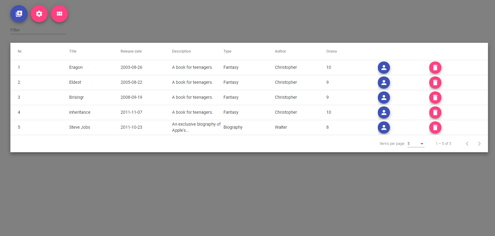

# Spring Boot 2 Angular 10 Book Library

This example app shows how to create a Spring Boot API and display its data with an Angular UI on the example book library. 

## Technologies
Backend:
* JAVA version 8
* Spring Boot 2
* Spring Data
* H2 database
* Maven
* Lombok

Frontend:
* Angular 10
* Angular Material

## Links
* [Backend](https://github.com/KrzysztofFyrla/Spring-Boot-2-Angular-10-Book-Library/tree/master/book-library-backend)
* [Frontend](https://github.com/KrzysztofFyrla/Spring-Boot-2-Angular-10-Book-Library/tree/master/book-library)

## Information
You will find more information: https://krzysztoffyrla.pl
